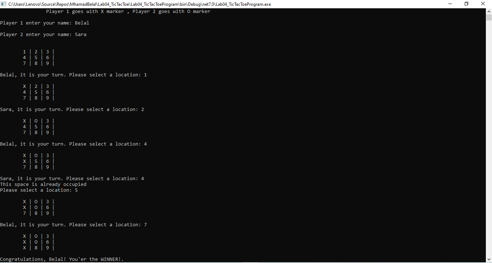
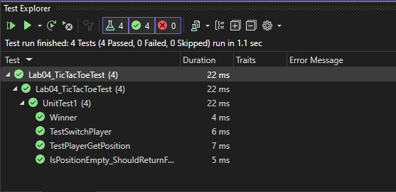

# Lab04_TicTacToe

## Description

The Tic-Tac-Toe game is played on a 3x3 grid, where two players take turns filling in the squares with their symbols, typically 'X' and 'O'. 
The objective is to create a winning pattern by placing three of their symbols in a horizontal, vertical, or diagonal row. 
If all the squares are filled and no player has won, the game ends in a draw. 
This project implements the Tic-Tac-Toe game using C# on a console platform.

---

## Preview

Here's a sample of what the TicTacToe game looks like when played:

---

## How to Use

To start playing the Tic-Tac-Toe game, you can follow these simple steps:

1. Begin by cloning the repository or downloading the source code to your local machine.

2. Open the project using your preferred development environment, such as Visual Studio.

3. Make sure to build the solution to resolve any dependencies and ensure everything is set up correctly.

4. Run the application to launch the Tic-Tac-Toe game.

5. The game will ask each player to enter their names and assign 'X' and 'O' symbols to them.

6. Once the players' names and symbols are set, the game board will be displayed on the screen.

7. Players will take turns making their moves by entering the corresponding number for the desired position on the 3x3 grid (numbers 1 to 9).

8. After each move, the game will update the board and display the new state, showing the current positions of 'X' and 'O'.

9. The game will continue until a winner is determined by forming a winning pattern (e.g., three symbols in a row, column, or diagonal) or until all positions on the grid are filled, resulting in a draw.

10. Once the game concludes, the final result, whether it's a win for one player or a draw, will be displayed on the screen.

11. Players will have the option to choose whether they want to play again or exit the game.

By following these steps, you can enjoy playing Tic-Tac-Toe with the provided application.

--- 

## Additional Details

Automated unit tests are included to verify the correctness of critical game functions.

